# NXP Application Code Hub

## P3T1085UK: ±0.5 °C accurate temperature-to-digital converter with a -40 °C to +125 °C range.

- This example demo describes how to configure the accurate temperature sensor P3T1085UK for temperature measurement. This sensor can be used in many industrial and medical applications.

- NXP’s next-generation sensors feature a strong balance of intelligent integration, logic and customizable platform software to enable smarter, more differentiated applications.

- Easy enablement is of utmost importance to reduce evaluation, development & time to market. NXP’s Sensor development ecosystem is making it easier for customers to accelerate their sensor product development.

- The image below shows Sensors Development Ecosystem Offering:

    [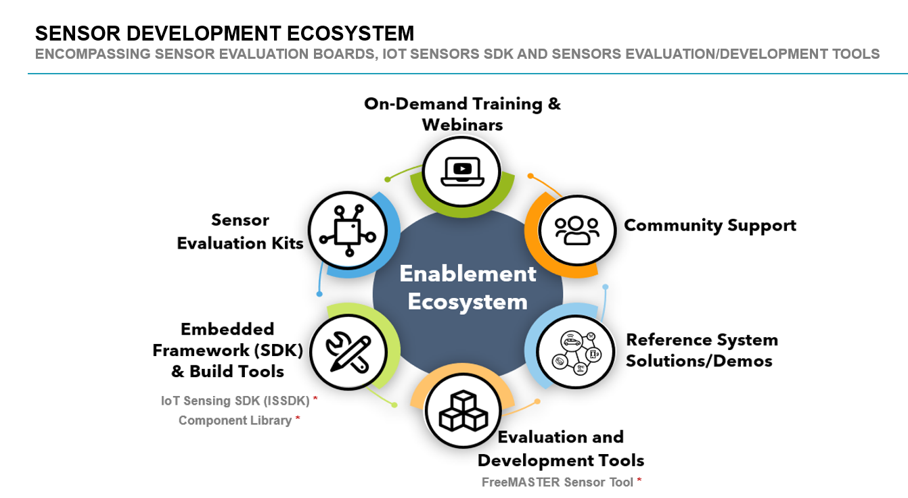](Sensors_Development_Ecosystem.png)

 
#### Boards: FRDM-MCXN947
#### Accessories: nxp_p3t1085uk_ard
#### Categories: Sensor
#### Peripherals: I2C
#### Toolchains: MCUXpresso IDE

## Table of Contents
1. [Software](#step1)
2. [Hardware](#step2)
3. [Setup](#step3)
4. [Run Example Projects](#step4)
5. [Run P3T1085UK Demo Example](#step5)
5. [FAQs](#step6) 
6. [Support](#step7)
7. [Release Notes](#step8)

## 1. Software
- [IoT Sensing SDK (ISSDK) v1.8](https://nxp.com/iot-sensing-sdk) offered as middleware in MCUXpresso SDK for supported platforms
- [MCUXpresso SDK v2.14.0 for FRDM-MCXN947](https://mcuxpresso.nxp.com/en/select)
- [MCUXpresso IDE v11.9.0](https://www.nxp.com/design/design-center/software/development-software/mcuxpresso-software-and-tools-/mcuxpresso-integrated-development-environment-ide:MCUXpresso-IDE)
- Git v2.39.0

## 2. Hardware
- FRDM-MCXN947 MCU board
- P3T1085UK Shield board
- Personal Computer
- Mini/micro C USB cable

## 3. Setup
### 3.1 Step 1: Download and Install required Software(s)
- Install MCUXpresso IDE 11.9.0
- Download and Install [MCUXpresso SDK v2.14.0 for FRDM-MCXN947](https://mcuxpresso.nxp.com/en/builder?hw=FRDM-MCXN947). Make sure to select ISSDK  middleware while building SDK.
- Install Git v2.39.0 (for cloning and running west commands)

### 3.2 Step 2: Clone the APP-CODE-HUB/dm-p3t1085uk-temperature-sensor-driver-with-demo-app
- Clone this repository to get the example projects:
- Change directory to cloned project folder: 
    cd *dm-p3t1085uk-temperature-sensor-driver-with-demo-app*

**Note:** If you are using Windows to clone the project, then please configure filename length limit using below command
 
**git config --system core.longpaths true**

### 3.3 Step 3: Build example projects
- Open MCUXpresso IDE and select a directory to create your workspace.
- Install MCXUpresso SDK 2.14.0 for FRDM-MCX947 (drag and drop SDK zip into "Installed SDK" view) into MCUXpresso IDE.
- Go to "Quickstart Panel" and click on "Import Project(s) from file system",
- Select "Project directory (unpacked)" and browse to the cloned project folder.
- Select example projects that you want to open and run.
- Right click on project and select build to start building the project.

## 4. Run Example Projects
- Connect the chosen example project HW: FRDM-MCXN947 with P3T1085UK-ARD.
- Right click on project and select "Debug As". Select MCUXpresso IDE LinkServer (inc. CMSIS DAP) probes.
- Connect a USB cable between the host PC and the MCU-Link USB port on the target board.
- Either press the reset button on your board or launch the debugger in your IDE to begin running the demo.

## 5. Run P3T1085UK Demo Example

- User need to check COM port after connecting USB cable between Host PC and Target Board via device manager.

[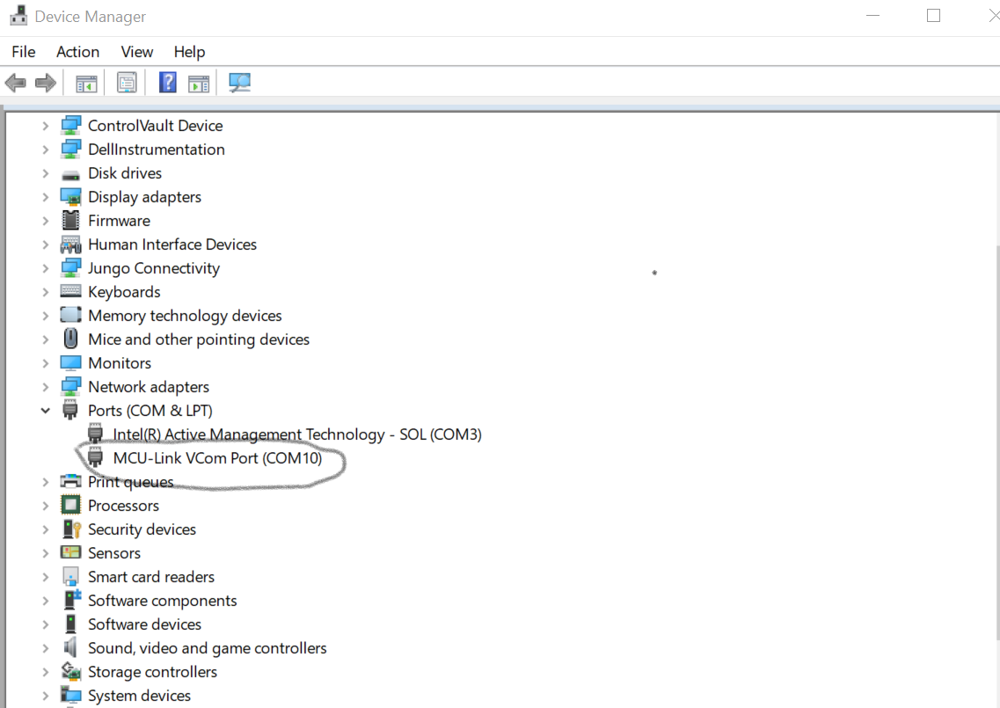](device_manager.png)

- Open PUTTY/Teraterm application installed on your Windows PC with Baudrate 115200 and assigned COM port as mentioned in above step.

[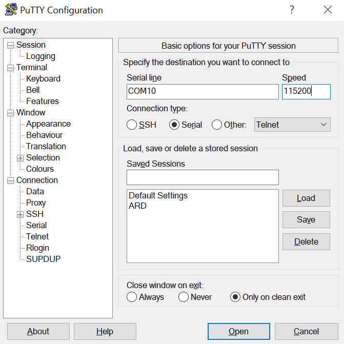](device_manager.png)

- After right click on project and select "Debug As", Demo application will run in interactive mode. When the demo runs successfully, you can see the logs printed on the terminal.

LOGS:

[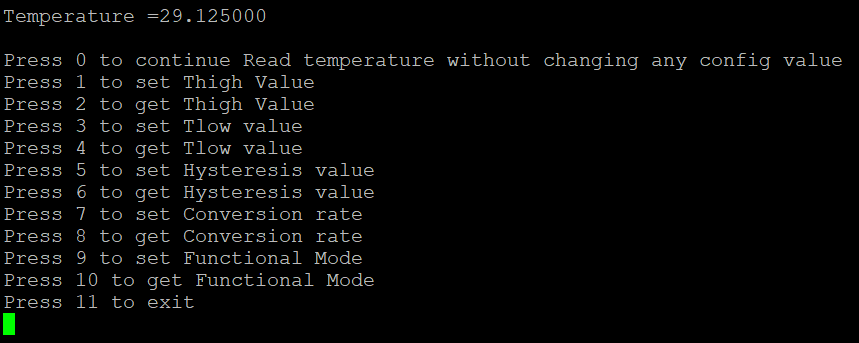](Putty_log_1.png)

1) If user press 0, there will be no change in device configuarion settings. Application will read the temperature 
and printed on the console.

LOGS:

[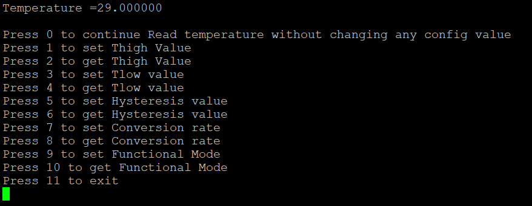](Putty_log2.png)

2) If user press 1, then user can set the High threshold temperature value from -25C to 127C.

LOGS:

[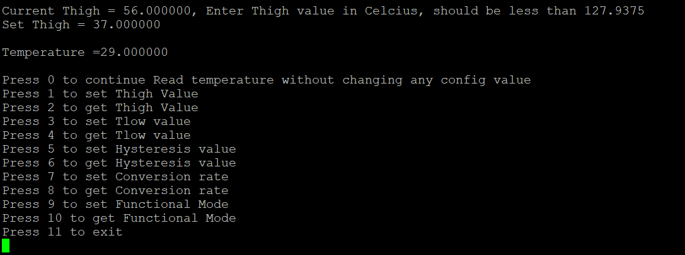](putty_log_3.png)

3) If user press 2, then user can get the High threshold temperature.

LOGS:

[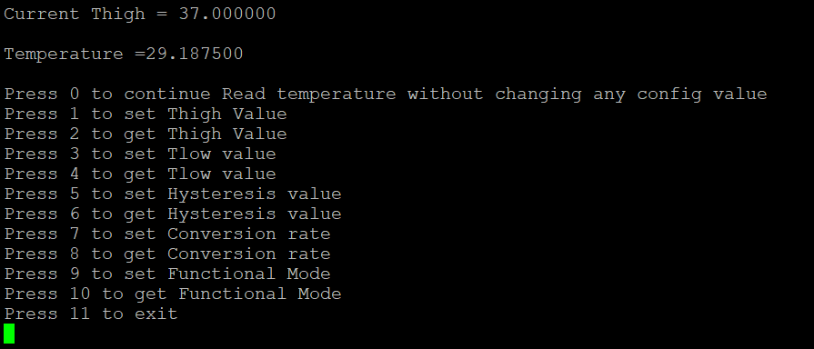](Putty_log_4.png)

4) If user press 3, then user can set Low threshold temperature.

LOGS:

[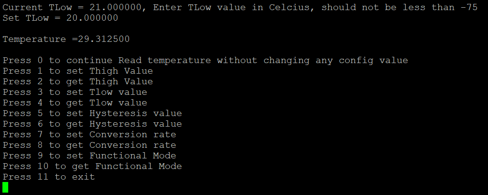](Putty_log_5.png)

5) If user press 4, then user can get Low threshold temperature.

LOGS:

[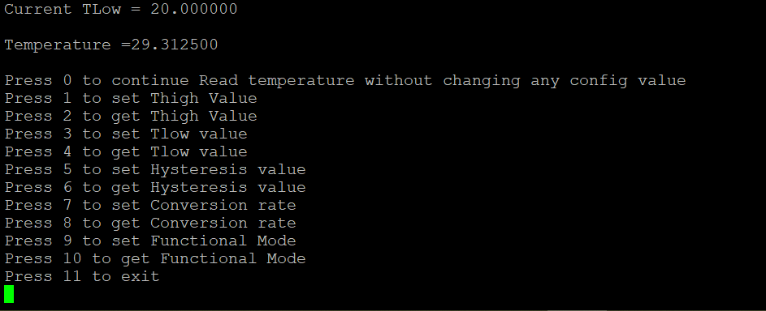](Putty_log_6.png)

6) If user press 5, then user can set Hysteresis value.

LOGS:

[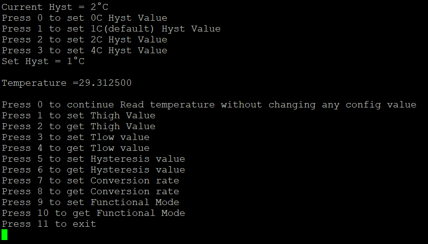](Putty_log_7.png)

7) If user press 6, then user can get Hysteresis value.

LOGS:

[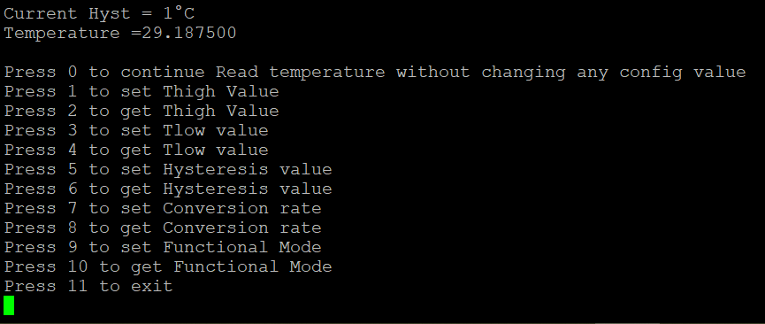](Putty_log_8.png)

8) If user press 7, then user can set the Conversion rate.

LOGS:

[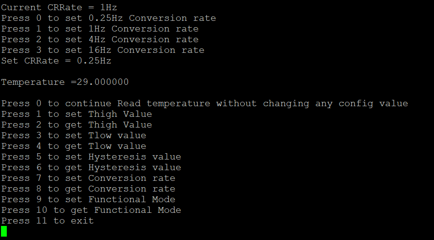](Putty_log_9.png)

9) If user press 8, then user can get the Conversion rate.

LOGS:

[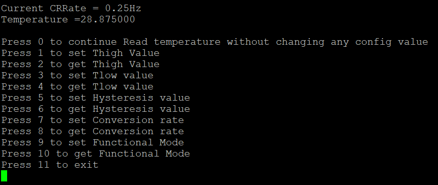](Putty_log_10.png)

10) If user press 9, then user can set the different functional mode.

LOGS:

[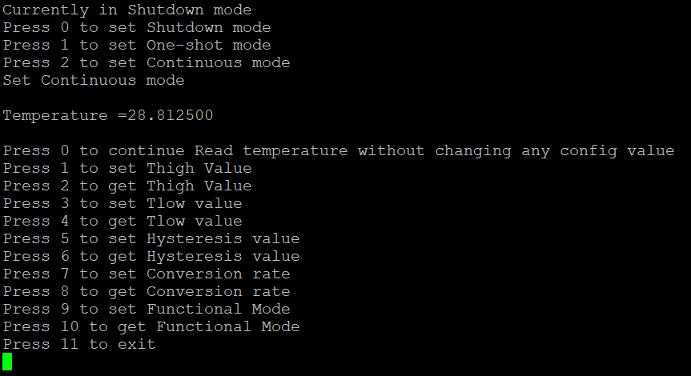](Putty_log_11.png)

11) If user press 10, then user can get the different functional mode.

LOGS:

[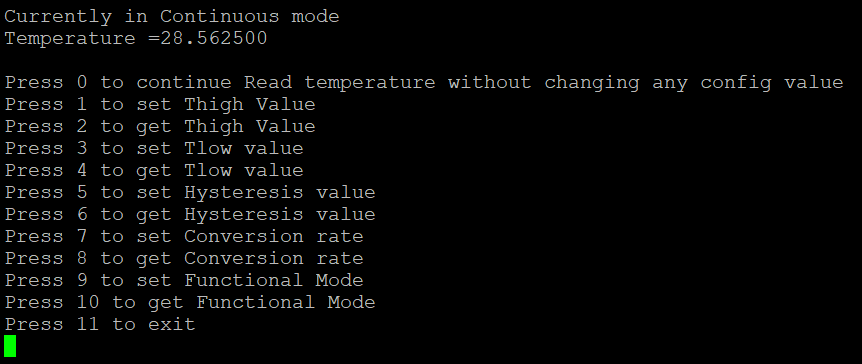](Putty_log_12.png)

Note 1: This test application will monitor the temperature continuously.
Different options are available to change the configuration settings of sensor device and device to operate
in different mode. In case of under-temperature and overtemperature condition an ALERT LED D2 Glow on Arduino Board.

Note 2: P3T1085_I2C_Initialize() API should be called first in order to use other APIs for different device features.
User can refer p3t1085uk_drv.h header file for more information.

## 6. FAQs
*No FAQs have been identified for this project.*

## 7. Support
*Provide URLs for help here.*

#### Project Metadata
<!----- Boards ----->

<!----- Categories ----->

<!----- Peripherals ----->

<!----- Toolchains ----->

Questions regarding the content/correctness of this example can be entered as Issues within this GitHub repository.

>**Warning**: For more general technical questions regarding NXP Microcontrollers and the difference in expected funcionality, enter your questions on the [NXP Community Forum](https://community.nxp.com/)

## 8. Release Notes
| Version | Description / Update                           | Date                        |
|:-------:|------------------------------------------------|----------------------------:|
| 1.0     | Initial release on Application Code Hub        | March 28th 2024 |

